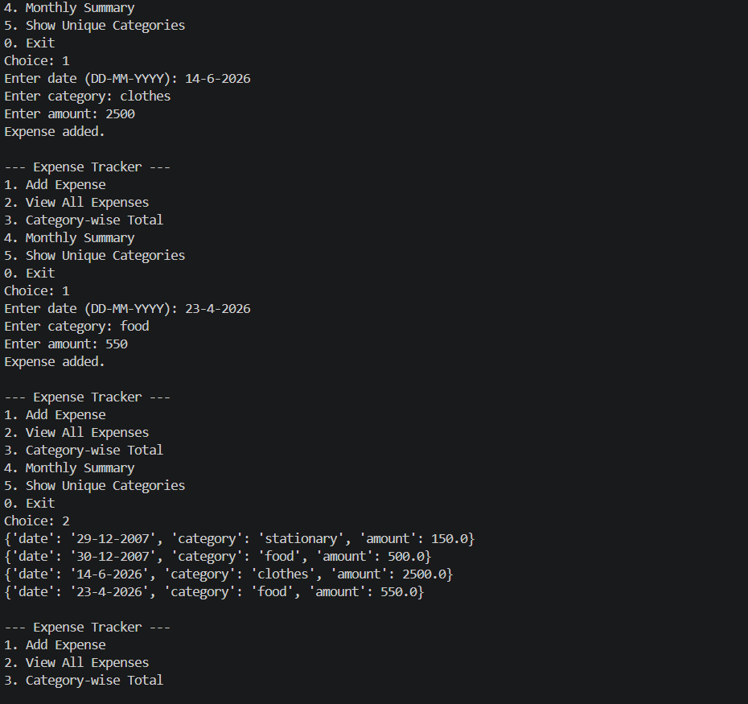
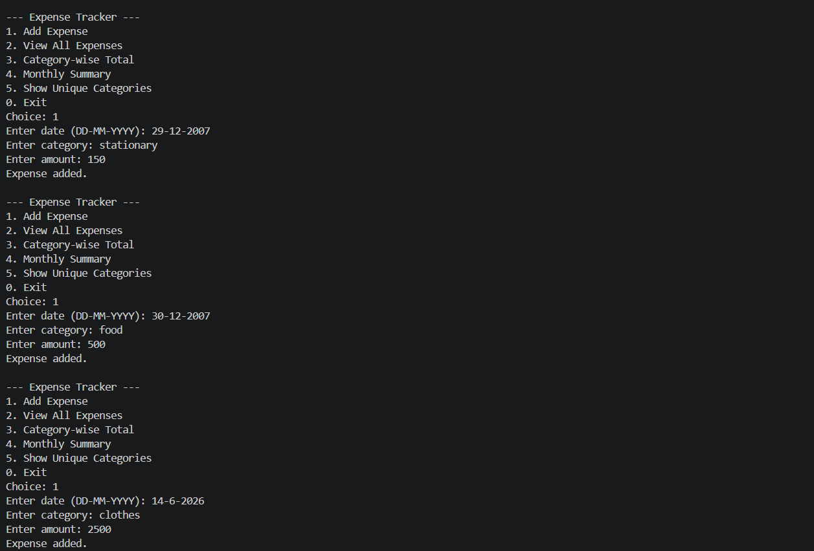
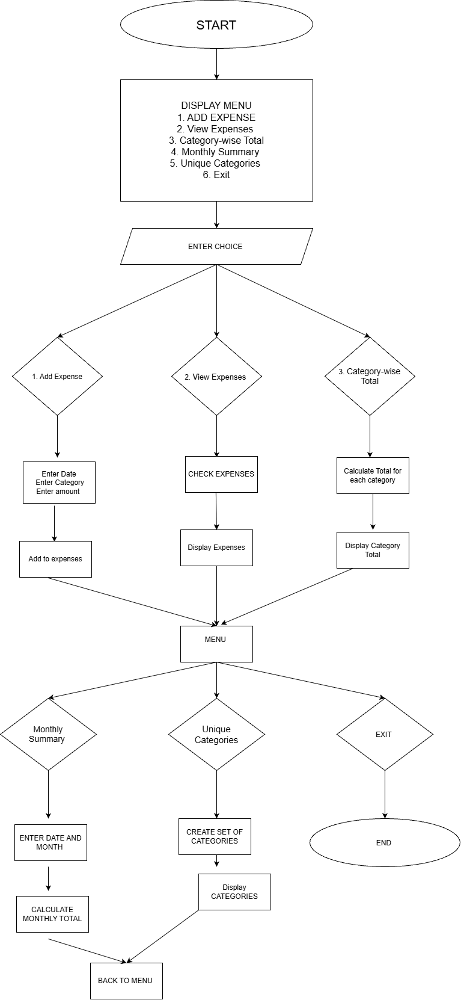
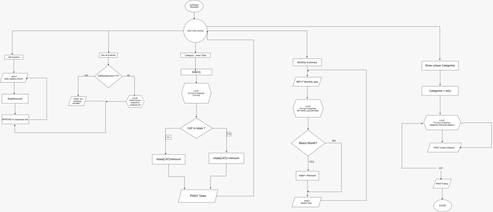

# Expense Tracker

It is a simple python program used to record and manage daily expenses.
The program allows users to add expenses, view all recorded expenses, calculate category-wise totals, view monthly expenses, and display unique expense categories.
This project is designed using basic Python concepts such as lists, dictionaries, sets, loops, and conditional Statements.

## features 
- Add a new expense
- View all expenses
- Calculate category-wise total expenses
- View total expenses for a particular month
- Display unique expense categories
- Exit the program

## Technologies Used 
- Python 3
- Lists
- Dictionaries
- Sets
- while and for loops
- Conditional statements 
- String methods
- User input

## How to Run
1. Make sure Python is installed opn you computer
2. Clone or download this repository 
3. Open the project folder in VS code or a terminal 
4. Run the following command:

```bash
python 4_expense_tracker.py 
```
5. The expense tracker will run  

## Testing 

-Added different expenses with dates, categories, and amounts.
-Checked whether all added expenses were displayed correctly.
-Checked category-wise total calculations.
-Tested the monthly summary using different months.
-Checked whether unique categories were displayed correctly.
-Tested the invalid choice option.
-Tested the exit option.

## Project Structure

```text
vitproj/
├── 4_expense_tracker.py
├── README.md
├── statement.md
├── screenshotexpence.png
└── screenshotexpence2.png
```

## Screenshot 



## Diagrams


### Use Case Diagram


### Workflow Diagram

